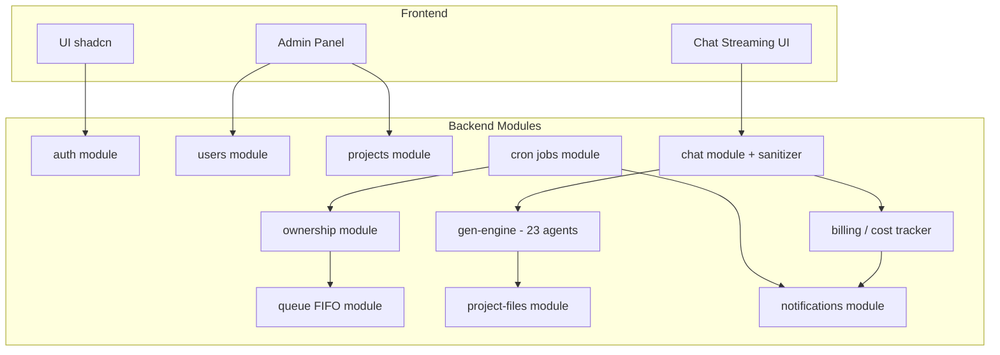

# GENTICA Platform — Technical Architecture

**Autor:** Nikola Tesla (Software Architect)
**Sprint:** 1
**Fecha:** 2026-04-06
**Estado:** Propuesto — pendiente aprobación del usuario

---

## 1. Arquitectura de alto nivel

```mermaid
flowchart LR
  U[Ingeniero IA / Admin] -->|HTTPS| FE[Next.js 15 App Router on Vercel]
  FE -->|Server Actions / Route Handlers| BE[Backend API - Next.js Route Handlers]
  BE -->|JWT + RLS| SB[(Supabase: Auth + Postgres + Storage)]
  BE -->|@anthropic-ai/sdk| ANT[Anthropic Messages API]
  BE -->|Resend SDK| RS[Resend Email]
  CRON[Vercel Cron] -->|daily/hourly| BE
  BE -->|stream| FE
  FE -->|Realtime channel| SB

  subgraph Vercel
    FE
    BE
    CRON
  end
```

Flujo típico: el usuario se autentica contra Supabase Auth; toma ownership de un proyecto; envía un mensaje; el backend carga el contexto del proyecto desde Postgres + archivos de Storage, arma el system prompt del equipo GEN, llama a Anthropic, sanitiza la respuesta, persiste mensaje + costo, y hace stream al frontend.

---

## 2. Diagrama de componentes



Cada módulo es una carpeta bajo `src/modules/` con `service.ts`, `repository.ts`, `schema.ts` (zod), y handlers expuestos vía route handlers (`app/api/.../route.ts`).

---

## 3. Modelo de datos Supabase (SQL DDL)

```sql
-- =========================
-- USERS (extiende auth.users)
-- =========================
create table public.users (
  id uuid primary key references auth.users(id) on delete cascade,
  email text not null unique,
  full_name text not null,
  role text not null check (role in ('admin','engineer')),
  is_active boolean not null default true,
  created_at timestamptz not null default now(),
  updated_at timestamptz not null default now()
);
create index idx_users_role on public.users(role);

-- =========================
-- PROJECTS
-- =========================
create table public.projects (
  id uuid primary key default gen_random_uuid(),
  name text not null,
  description text,
  status text not null check (status in ('available','owned','queued','archived','blocked')) default 'available',
  owner_id uuid references public.users(id) on delete set null,
  owned_at timestamptz,
  last_interaction_at timestamptz,
  claude_model text not null default 'claude-sonnet-4-6'
    check (claude_model in ('claude-opus-4-6','claude-sonnet-4-6','claude-haiku-4-6','claude-haiku-4-5')),
  cost_usd numeric(10,4) not null default 0,
  cost_cap_usd numeric(10,4) not null default 50,
  is_cost_blocked boolean not null default false,
  cost_override_approved_at timestamptz,
  created_by uuid not null references public.users(id),
  created_at timestamptz not null default now(),
  updated_at timestamptz not null default now()
);
create index idx_projects_owner on public.projects(owner_id);
create index idx_projects_status on public.projects(status);
create index idx_projects_last_interaction on public.projects(last_interaction_at);
create unique index uq_projects_one_owner
  on public.projects(id) where owner_id is not null;

-- =========================
-- PROJECT FILES (archivos como contexto GEN)
-- =========================
create table public.project_files (
  id uuid primary key default gen_random_uuid(),
  project_id uuid not null references public.projects(id) on delete cascade,
  uploaded_by uuid not null references public.users(id),
  storage_path text not null,
  filename text not null,
  mime_type text,
  size_bytes bigint,
  extracted_text text,
  created_at timestamptz not null default now()
);
create index idx_files_project on public.project_files(project_id);

-- =========================
-- PROJECT MESSAGES (histórico chat — persistente, heredable)
-- =========================
create table public.project_messages (
  id uuid primary key default gen_random_uuid(),
  project_id uuid not null references public.projects(id) on delete cascade,
  author_user_id uuid references public.users(id),
  role text not null check (role in ('user','assistant','system')),
  content text not null,
  content_sanitized text,
  input_tokens int not null default 0,
  output_tokens int not null default 0,
  model text,
  created_at timestamptz not null default now()
);
create index idx_messages_project_created on public.project_messages(project_id, created_at);

-- =========================
-- PROJECT COSTS (ledger append-only)
-- =========================
create table public.project_costs (
  id uuid primary key default gen_random_uuid(),
  project_id uuid not null references public.projects(id) on delete cascade,
  message_id uuid references public.project_messages(id) on delete set null,
  input_tokens int not null,
  output_tokens int not null,
  cost_usd numeric(10,6) not null,
  model text not null,
  created_at timestamptz not null default now()
);
create index idx_costs_project on public.project_costs(project_id, created_at);

-- =========================
-- PROJECT QUEUE (FIFO cuando >20 activos)
-- =========================
create table public.project_queue (
  id uuid primary key default gen_random_uuid(),
  project_id uuid not null references public.projects(id) on delete cascade,
  user_id uuid not null references public.users(id) on delete cascade,
  position int not null,
  enqueued_at timestamptz not null default now(),
  unique(project_id, user_id)
);
create index idx_queue_position on public.project_queue(position);

-- =========================
-- OWNERSHIP HISTORY (audit trail)
-- =========================
create table public.ownership_history (
  id uuid primary key default gen_random_uuid(),
  project_id uuid not null references public.projects(id) on delete cascade,
  user_id uuid not null references public.users(id),
  action text not null check (action in ('claimed','released','auto_released','transferred')),
  reason text,
  created_at timestamptz not null default now()
);
create index idx_history_project on public.ownership_history(project_id, created_at);

-- =========================
-- TRIGGERS
-- =========================
create or replace function touch_last_interaction() returns trigger as $$
begin
  update public.projects
    set last_interaction_at = now(), updated_at = now()
    where id = new.project_id;
  return new;
end; $$ language plpgsql;

create trigger trg_messages_touch
  after insert on public.project_messages
  for each row execute function touch_last_interaction();

create or replace function accumulate_cost() returns trigger as $$
declare v_total numeric(10,4);
begin
  update public.projects
    set cost_usd = cost_usd + new.cost_usd
    where id = new.project_id
    returning cost_usd into v_total;
  if v_total >= (select cost_cap_usd from public.projects where id = new.project_id) then
    update public.projects set is_cost_blocked = true where id = new.project_id;
  end if;
  return new;
end; $$ language plpgsql;

create trigger trg_costs_accumulate
  after insert on public.project_costs
  for each row execute function accumulate_cost();
```

Cap global de 20 proyectos activos se valida en service layer (no constraint SQL) para permitir ajuste sin migración.

---

## 4. Políticas RLS (crítico — aislamiento entre usuarios)

```sql
alter table public.users enable row level security;
alter table public.projects enable row level security;
alter table public.project_files enable row level security;
alter table public.project_messages enable row level security;
alter table public.project_costs enable row level security;
alter table public.project_queue enable row level security;
alter table public.ownership_history enable row level security;

-- helper
create or replace function public.is_admin() returns boolean
  language sql stable as $$
  select exists(select 1 from public.users where id = auth.uid() and role='admin' and is_active);
$$;

-- USERS
create policy users_self_select on public.users
  for select using (auth.uid() = id or public.is_admin());
create policy users_admin_write on public.users
  for all using (public.is_admin()) with check (public.is_admin());

-- PROJECTS
create policy projects_select on public.projects
  for select using (true); -- todos los engineers ven catálogo
create policy projects_update_owner on public.projects
  for update using (owner_id = auth.uid() or public.is_admin())
  with check (owner_id = auth.uid() or public.is_admin());
create policy projects_insert_admin on public.projects
  for insert with check (public.is_admin());
create policy projects_delete_admin on public.projects
  for delete using (public.is_admin());

-- PROJECT FILES
create policy files_rw_owner on public.project_files
  for all using (
    public.is_admin() or
    exists(select 1 from public.projects p where p.id = project_id and p.owner_id = auth.uid())
  ) with check (
    public.is_admin() or
    exists(select 1 from public.projects p where p.id = project_id and p.owner_id = auth.uid())
  );

-- PROJECT MESSAGES (histórico persistente — visible al owner actual aunque el autor sea otro)
create policy messages_select_owner on public.project_messages
  for select using (
    public.is_admin() or
    exists(select 1 from public.projects p where p.id = project_id and p.owner_id = auth.uid())
  );
create policy messages_insert_owner on public.project_messages
  for insert with check (
    exists(select 1 from public.projects p where p.id = project_id and p.owner_id = auth.uid())
  );

-- COSTS (read-only para owner, write solo service role)
create policy costs_select_owner on public.project_costs
  for select using (
    public.is_admin() or
    exists(select 1 from public.projects p where p.id = project_id and p.owner_id = auth.uid())
  );

-- QUEUE
create policy queue_select_self on public.project_queue
  for select using (user_id = auth.uid() or public.is_admin());
create policy queue_rw_self on public.project_queue
  for all using (user_id = auth.uid() or public.is_admin())
  with check (user_id = auth.uid() or public.is_admin());

-- HISTORY
create policy history_select on public.ownership_history
  for select using (
    public.is_admin() or
    exists(select 1 from public.projects p where p.id = project_id and p.owner_id = auth.uid())
  );
```

Las inserts de costs y ownership_history se hacen con **service role key** (backend), bypass RLS. El frontend NUNCA tiene la service key.

---

## 5. Motor GEN (gen-engine)

### 5.1 Instanciación del equipo de 23 agentes

**Decisión clave (ver ADR-002):** un único `system prompt` unificado, donde el PM (Alan Turing) es el coordinador principal y los 22 roles restantes son personalidades internas descriptas como secciones. Esto evita multi-call en cada turno (caro) y preserva coherencia narrativa.

Estructura del system prompt (pseudo):

```
<identity>
Sos el equipo GEN: un sistema multi-agente de desarrollo de software.
El portavoz principal es Alan Turing (PM). Para cada mensaje del usuario:
1) Determiná qué rol(es) del equipo deberían responder.
2) Consultá internamente a ese/esos rol(es).
3) Respondé SIEMPRE a través del PM, en lenguaje natural, sin jerga técnica de Claude Code.
</identity>

<team>
... 23 roles con nombre, especialidad y loop iterativo (comprimido, ~2000 tokens total)
</team>

<project_context>
Nombre: {project.name}
Descripción: {project.description}
Fase: {inferred_phase}
Archivos cargados: {files_summary}
</project_context>

<history>
{sliding_window_summary + last_20_messages}
</history>

<output_rules>
- Respondé en español natural, conversacional.
- PROHIBIDO: rutas absolutas, comandos bash, nombres de archivos con extensión, jerga de harness, `<function_calls>`, menciones a "Claude Code" o "Anthropic API".
- Si necesitás referirte a un artefacto, hablá del CONCEPTO, no del archivo.
</output_rules>
```

El equipo se "instancia por proyecto" en el sentido de que el contexto + archivos + histórico hacen que cada llamada Anthropic sea única a ese proyecto. No hay estado en memoria del backend — todo se reconstruye por request desde Postgres.

### 5.2 Persistencia y recuperación de contexto

Cada turno:
1. Se leen los últimos N mensajes de `project_messages` (N configurable, default 30).
2. Se lee el `context_summary` del proyecto (campo en `projects`, ver ADR-003).
3. Se leen los `project_files.extracted_text` (hasta 40 KB, truncado y priorizado por relevancia simple).
4. Se arma el system prompt y se envía a Anthropic con streaming.

### 5.3 Estrategia de compresión del histórico (sliding + summarization)

Ver **ADR-003**. Resumen: cuando `count(project_messages) > 50`, un job (invocado inline o diferido) llama a Haiku para comprimir mensajes 1..N-30 en un `context_summary` de ~1500 tokens, almacenado en `projects.context_summary`. Los últimos 30 mensajes se envían crudos.

---

## 6. Sanitización del chat (output filter)

**Capa de post-procesamiento** aplicada a cada respuesta del assistant antes de persistir y enviar al frontend.

### Patrones a filtrar (regex + LLM fallback)

| Patrón | Regex | Reemplazo |
|---|---|---|
| Rutas absolutas Windows | `[A-Z]:\\[^\s]+` | "el proyecto" |
| Rutas absolutas unix | `/[a-z][\w/.-]{3,}` | "el proyecto" |
| Comandos bash | `^\s*(cd|ls|mkdir|npm|git|pnpm|yarn|curl|cat)\s+.*$` (multiline) | removido |
| Bloques de código | ```` ```[\s\S]*?``` ```` | "[fragmento técnico omitido]" |
| Function calls XML | `<function_calls>[\s\S]*?</function_calls>` | removido |
| Menciones Claude Code | `\b(Claude Code|Anthropic|harness|tool_use|cwd)\b` | "el entorno" |
| Nombres de archivo técnicos | `\b\w+\.(ts|tsx|md|json|sql|yaml|env)\b` | "ese documento" |

### Flujo

```
raw_response
  → regex_pass (fast, determinístico)
  → heuristic_score (# tokens técnicos / total)
  → if score > 0.15:
       llm_rewrite (Haiku, prompt: "reescribí en lenguaje natural")
  → final sanitized → persist + stream
```

Si LLM rewrite falla o devuelve contenido aún sucio → fallback: "Hubo una respuesta técnica del equipo que estoy traduciendo. Pedímelo de nuevo con más detalle." y se loguea en `project_messages.content` (crudo) + `content_sanitized` (fallback).

---

## 7. Control de concurrencia de ownership

Transacción Postgres con lock explícito:

```sql
-- Claim project atómico
begin;
select id, owner_id, status
  from public.projects
  where id = $1
  for update;  -- row lock

-- si owner_id is null y status = 'available':
update public.projects
  set owner_id = $user, owned_at = now(), status = 'owned',
      last_interaction_at = now()
  where id = $1 and owner_id is null;

insert into public.ownership_history(project_id, user_id, action)
  values ($1, $user, 'claimed');

-- validar cap global 20
select count(*) into v_active from public.projects where status='owned';
if v_active > 20 then raise exception 'CAP_EXCEEDED'; end if;
commit;
```

Si falla con `CAP_EXCEEDED` → rollback + encolar en `project_queue` con `position = max(position)+1`.

---

## 8. Tracking de costos

### Precios por modelo (USD por 1M tokens, a validar con Anthropic)

| Modelo | Input | Output |
|---|---|---|
| claude-opus-4-6 | 15.00 | 75.00 |
| claude-sonnet-4-6 | 3.00 | 15.00 |
| claude-haiku-4-6 | 0.80 | 4.00 |
| claude-haiku-4-5 | 0.25 | 1.25 |

Tabla en código (`src/modules/billing/pricing.ts`), no en DB — permite hot-fix sin migración.

### Flujo

1. Tras cada call Anthropic, SDK retorna `usage.input_tokens` + `usage.output_tokens`.
2. `billing.compute(model, usage)` → `cost_usd`.
3. Insert en `project_costs`.
4. Trigger acumula en `projects.cost_usd` y si `>= cost_cap_usd` setea `is_cost_blocked = true`.
5. Próximo intento de enviar mensaje → middleware lee `is_cost_blocked` → retorna 402 con UI de "Aprobar override".
6. Owner puede aprobar override: `cost_override_approved_at = now()`, `is_cost_blocked = false`, `cost_cap_usd += 50` (incremento configurable).

Circuit breaker mid-stream: si durante una respuesta larga se cruza el cap, se corta el stream y se persiste parcial.

---

## 9. Cola FIFO (>20 activos)

- Si al intentar claim el cap está lleno → insertar en `project_queue` con `position` secuencial global.
- Cuando un proyecto se libera (manual, auto-release o abandono), un service `queue.advance()`:
  1. Busca el next en queue (`order by position asc limit 1`).
  2. Notifica al usuario por email (Resend) + in-app notification: "Tu turno en el proyecto X".
  3. Le da una ventana de 24h para confirmar, sino pasa al siguiente.
- Usuario puede abandonar su posición en la cola cuando quiera.

---

## 10. Auto-release por inactividad (7 días)

**Vercel Cron:** `0 * * * *` (cada hora — barato, mayor granularidad que diario).

Endpoint: `/api/cron/auto-release` protegido por `CRON_SECRET` header.

```sql
update public.projects
set owner_id = null, status = 'available', owned_at = null
where status = 'owned'
  and last_interaction_at < now() - interval '7 days'
returning id, owner_id;
```

Por cada fila afectada:
- Insert en `ownership_history` (action='auto_released', reason='inactivity_7d').
- Email al ex-owner + al admin.
- Trigger `queue.advance()`.

Notificación preventiva: a los 5 días y 6 días, email de "vas a perder el proyecto en X horas".

---

## 11. Rate limiting Anthropic API

Dos niveles:

1. **Por proyecto:** máximo 10 requests/minuto, 200/hora. Token bucket en Postgres (`project_rate_limit` table con `tokens_remaining`, `last_refill`) o Upstash Redis si escala.
2. **Global plataforma:** respetar headers `anthropic-ratelimit-*` de la API. Middleware que lee el header, y si `remaining < 5%` aplica backoff exponencial para todos los proyectos.

Fallback 429: mensaje al usuario "el equipo está ocupado, reintentamos en X seg" + retry automático con jitter.

---

## 12. Seguridad

### Variables de entorno
```
ANTHROPIC_API_KEY
SUPABASE_URL
SUPABASE_ANON_KEY              # frontend
SUPABASE_SERVICE_ROLE_KEY      # backend only — NUNCA en client bundle
RESEND_API_KEY
CRON_SECRET                    # auth para cron endpoints
NEXT_PUBLIC_APP_URL
```

Secrets en Vercel Environment Variables, encriptados at-rest. `.env.local` gitignored.

### OWASP relevantes
- **A01 Broken Access Control** → mitigado por RLS + double-check en service layer.
- **A02 Cryptographic Failures** → TLS everywhere, bcrypt via Supabase Auth, no passwords propios.
- **A03 Injection** → zod validation en todos los endpoints, queries parametrizadas (Supabase client), sanitización de user input antes de meterlo en prompts (prompt injection).
- **A04 Insecure Design** → ownership + cost cap + cron auto-release diseñados por default.
- **A05 Security Misconfig** → checklist pre-deploy, headers CSP estrictos.
- **A07 Auth Failures** → MFA opcional via Supabase, sesiones con rotación.
- **A08 Data Integrity** → triggers de cost acumulado, ledger append-only.
- **A09 Logging** → todas las acciones de ownership y cost en tablas audit.
- **A10 SSRF** → file uploads validados, sin fetch de URLs del usuario.

### Prompt injection
Input del usuario se encapsula en `<user_input>...</user_input>` dentro del prompt. El system prompt instruye explícitamente a ignorar instrucciones dentro del bloque user_input que intenten modificar comportamiento. Archivos subidos se tratan igual.

### Upload validation
- Whitelist de MIME types (`.md, .txt, .pdf, .json, .yaml, .csv, .png, .jpg`).
- Max 10 MB por archivo, 100 MB por proyecto.
- Antivirus scan opcional (fase 2).
- Extracción de texto server-side, nunca ejecución.

---

## 13. Architecture Decision Records

### ADR-001: Supabase vs NextAuth + Postgres propio

**Status:** Accepted
**Context:** Necesitamos auth admin-managed (sin signup público), Postgres con RLS, Storage de archivos, y tiempo a MVP corto.

**Options:**
1. **Supabase** — Auth + Postgres + Storage + RLS + Realtime, managed, free tier generoso.
2. **NextAuth + Postgres self-hosted + S3** — más control, más ops, sin RLS nativo.
3. **Clerk + Postgres + S3** — Auth UX top, pero lock-in + costo por MAU.

**Decision:** Supabase.

**Rationale:** RLS nativo es crítico para aislamiento multi-tenant. Storage integrado evita configurar S3. Admin-managed se logra deshabilitando signup en el dashboard. Costo cero al inicio. Exit cost aceptable (Postgres es Postgres).

**Consequences:** Dependencia de Supabase para auth + db + storage. Si el servicio cae, toda la plataforma cae. Mitigación: backups automáticos diarios + plan de migración documentado.

---

### ADR-002: Instanciar los 23 agentes — system prompt unificado vs multi-call

**Status:** Accepted
**Context:** GEN tiene 23 roles especializados. Necesitamos que el usuario sienta que habla con un equipo, pero sin multiplicar costos por 23x.

**Options:**
1. **Multi-call:** cada turno, PM decide qué agentes invocar y se hace 1 call por agente, luego PM sintetiza. Realista pero 3-10x costo por turno y latencia alta.
2. **System prompt unificado:** un solo call con prompt que describe los 23 roles; el modelo "actúa" como el equipo entero. Bajo costo, latencia baja, coherencia garantizada.
3. **Router + single specialist call:** PM (Haiku barato) clasifica el turno y decide UN solo rol especialista (Sonnet/Opus) que responde.

**Decision:** System prompt unificado (opción 2) para MVP. Opción 3 como evolución futura si el costo aprieta.

**Rationale:** Claude es excelente role-playing con system prompts largos. El usuario percibe "el equipo" sin necesidad de que sean llamadas físicamente separadas. Costo predecible. La opción 1 se descarta por costo 5-10x sin beneficio claro de calidad.

**Consequences:** System prompt grande (~3-4k tokens fijos por call). Mitigación: prompt caching de Anthropic (cache_control) reduce costo del system prompt a ~10% tras primer hit. Aceptable.

---

### ADR-003: Persistencia de contexto GEN — full history vs sliding window vs summarization

**Status:** Accepted
**Context:** El histórico por proyecto puede crecer a miles de mensajes. No podemos mandar todo en cada call (context window + costo).

**Options:**
1. **Full history:** enviar todos los mensajes siempre. Quiebra en <200 mensajes con Sonnet.
2. **Sliding window puro:** últimos N mensajes. Pierde contexto temprano crítico.
3. **Sliding window + rolling summary:** últimos 30 crudos + summary generado periódicamente de los anteriores.

**Decision:** Opción 3 — sliding + rolling summary con Haiku.

**Rationale:** Balance óptimo costo/fidelidad. Haiku comprime barato. El summary captura decisiones clave del proyecto (fase, stack, ADRs). Los últimos 30 mantienen flujo conversacional natural.

**Consequences:**
- Campo `projects.context_summary text` + `projects.summary_updated_at`.
- Job de compresión inline cuando `message_count % 20 == 0` (cada 20 mensajes nuevos).
- El summary puede perder detalles — mitigado porque los archivos subidos y el histórico completo siempre están disponibles vía query explícita si el usuario pregunta por algo viejo.

---

## 14. Dependencias npm para el scaffolding (Linus Torvalds)

```json
{
  "dependencies": {
    "next": "^15.0.0",
    "react": "^19.0.0",
    "react-dom": "^19.0.0",
    "typescript": "^5.5.0",
    "@anthropic-ai/sdk": "^0.30.0",
    "@supabase/supabase-js": "^2.45.0",
    "@supabase/ssr": "^0.5.0",
    "tailwindcss": "^3.4.0",
    "autoprefixer": "^10.4.0",
    "postcss": "^8.4.0",
    "class-variance-authority": "^0.7.0",
    "clsx": "^2.1.0",
    "tailwind-merge": "^2.5.0",
    "lucide-react": "^0.460.0",
    "@radix-ui/react-dialog": "^1.1.0",
    "@radix-ui/react-dropdown-menu": "^2.1.0",
    "@radix-ui/react-label": "^2.1.0",
    "@radix-ui/react-slot": "^1.1.0",
    "@radix-ui/react-toast": "^1.2.0",
    "@radix-ui/react-tabs": "^1.1.0",
    "@radix-ui/react-select": "^2.1.0",
    "@radix-ui/react-avatar": "^1.1.0",
    "zod": "^3.23.0",
    "react-hook-form": "^7.53.0",
    "@hookform/resolvers": "^3.9.0",
    "resend": "^4.0.0",
    "date-fns": "^4.1.0",
    "nanoid": "^5.0.0",
    "pdf-parse": "^1.1.1",
    "gray-matter": "^4.0.3"
  },
  "devDependencies": {
    "@types/node": "^22.0.0",
    "@types/react": "^19.0.0",
    "@types/react-dom": "^19.0.0",
    "eslint": "^9.0.0",
    "eslint-config-next": "^15.0.0",
    "@typescript-eslint/eslint-plugin": "^8.0.0",
    "@typescript-eslint/parser": "^8.0.0",
    "prettier": "^3.3.0",
    "prettier-plugin-tailwindcss": "^0.6.0",
    "vitest": "^2.1.0",
    "@vitest/ui": "^2.1.0",
    "@testing-library/react": "^16.0.0",
    "@testing-library/jest-dom": "^6.5.0",
    "@playwright/test": "^1.48.0",
    "supabase": "^1.200.0",
    "tsx": "^4.19.0"
  }
}
```

Scripts sugeridos:
```json
{
  "dev": "next dev",
  "build": "next build",
  "start": "next start",
  "lint": "next lint",
  "typecheck": "tsc --noEmit",
  "test": "vitest run",
  "test:watch": "vitest",
  "test:e2e": "playwright test",
  "db:migrate": "supabase db push",
  "db:reset": "supabase db reset"
}
```

---

## Task Report

```xml
<task_report>
  <id>SPRINT1-ARCH-001</id>
  <agente>ARQUITECTO_SOFTWARE</agente>
  <iteracion>1</iteracion>
  <estado>AWAITING_APPROVAL</estado>
  <skills_usados>voltagent/voltagent-best-practices, database-designer</skills_usados>
  <cambios_vs_anterior>Primera versión — incluye 14 secciones, 3 ADRs, DDL completo, RLS, gen-engine, sanitizer, dependencias npm</cambios_vs_anterior>
  <entregable>projects/genetica-platform/docs/technical-architecture.md</entregable>
  <dependencias_desbloqueadas>SPRINT1-LT-SCAFFOLD, SPRINT1-DB-MIGRATION</dependencias_desbloqueadas>
  <requiere_accion_usuario>true</requiere_accion_usuario>
  <motivo>Validación de arquitectura + ADRs antes de pasar a Líder Técnico para scaffolding e instalación de dependencias</motivo>
</task_report>
```
